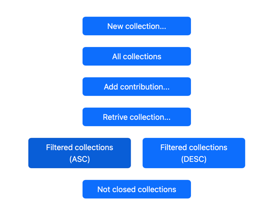
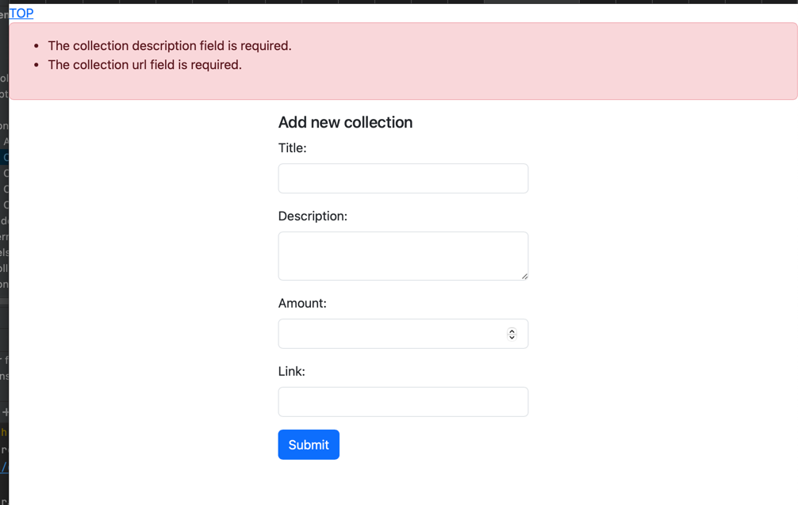
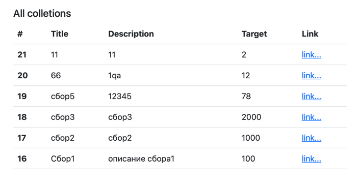
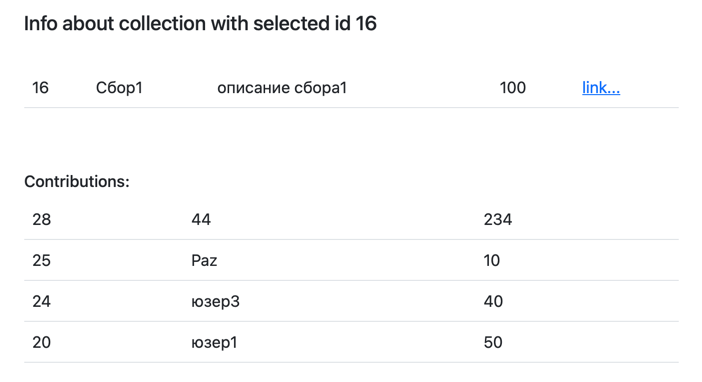
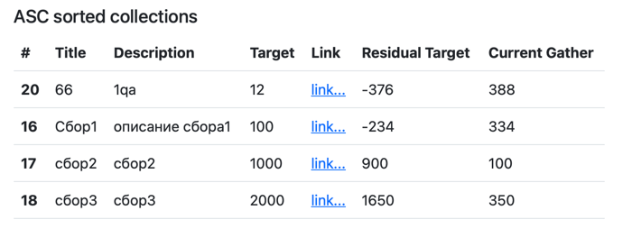
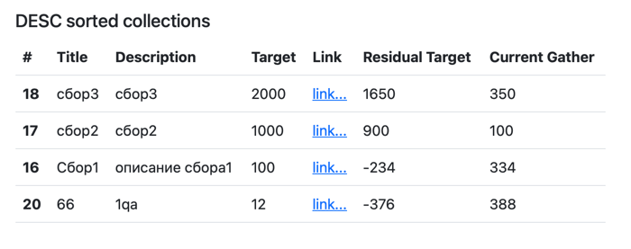
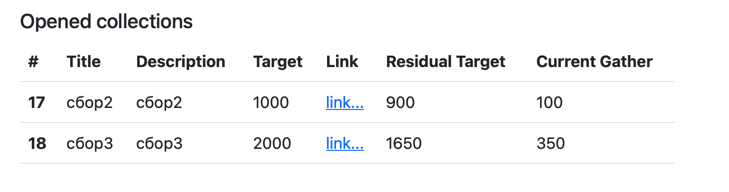

### root route for demonstration

### demonstrstion of validation when create new collection:

### all collections from DB

### additional info for selected collection

### asc filter

### desc filter

### not closed colletions

**\App\Http\Controllers\CollectionController controller for:**
- create new collection;
- show all collections
- show selected collection with contributions;

**\App\Http\Controllers\ContributorController controller for:**
- create new contribution;

**AscDescCollectionFilter controller for "order by" collection's filtration**

**OpenCollectionFilter controller for not closed collections view**